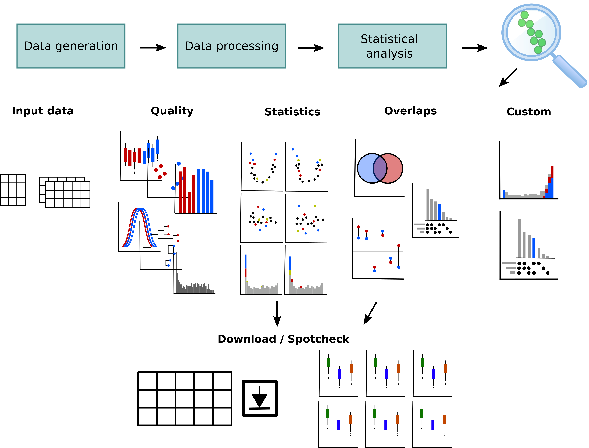

[](https://zenodo.org/badge/latestdoi/220755544)

# OmicLoupe

Understanding expression across comparisons and datasets



# Example data

Example data matrices and the corresponding design matrix is present in the folder `data/example_data`.
Upload one or both of the matrices `dia_umpire_data.tsv` and `openswath_data.tsv` together with the `design.tsv` as design matrix.
If using both, the options `Two datasets` and `Matched samples` should be checked.

# Installation

It can be installed either directly from GitHub or by downloading as a Zip. To install it directly from GitHub, open R and run the following command (requires the R package `devtools` to be installed):

```{r}
devtools::install_github("ComputationalProteomics/OmicLoupe")
```

## Running it locally

After installation, you can immediately run the program.
You can subsequently navigate to the browser to access the software.

```{r}
> OmicLoupe::runApp()
```

## Dependencies

The R packages used by OmicLoupe may have certain system dependences. If working on a Debian-based Linux distribution, these can be installed from the command line:

```
sudo apt install libcurl4-openssl-dev libxml2-dev libssl-dev libgit2-dev pandoc
```

## Running it as a Singularity container

Singularity is a container software which (similar to Docker) allows execution without needing to prepare local dependencies. It can be downloaded from https://singularity.lbl.gov.

Using Singularity can be a rapid way to get OmicLoupe running locally without needing to install all dependencies. First, retrieve the container:

```{bash}
singularity pull --name OmicLoupe.simg shub://ComputationalProteomics/OmicLoupe
```

This will download the Singularity container containing OmicLoupe to `OmicLoupe.simg`. Now you are ready to run OmicLoupe:

```{bash}
singularity run OmicLoupe.simg
```

Simply open the provided link in a browser, and you should have access to OmicLoupe.

## Running on a server

If you have a server running [Shiny Server](https://rstudio.com/products/shiny/shiny-server/) you can easily get OmicLoupe running by:

1. Install OmicLoupe (making sure it get installed at a path which Shiny Server can access)
2. Place a file called `app.R` within a folder in the `shiny-server` directory containing a single line calling OmicLoupe: `OmicLoupe::runApp()`

# Misc

You could make a convenient Bash alias for this, which lets you execute OmicLoupe by simply typing "omicloupe" into a Bash terminal.
Add this line to your .bash_aliases or .bashrc file.

```{r}
alias omicloupe="Rscript -e \"runApp()\""
```
